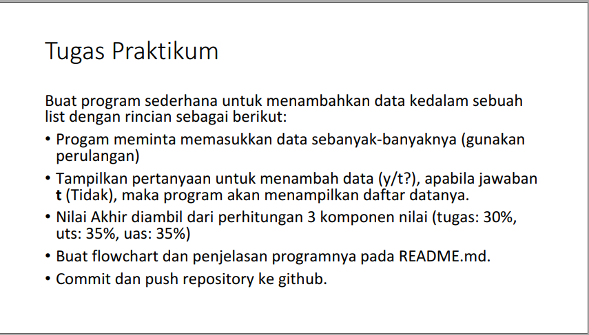
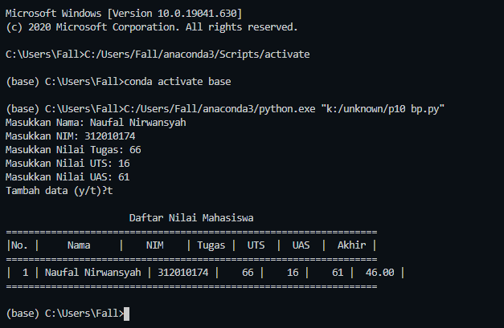
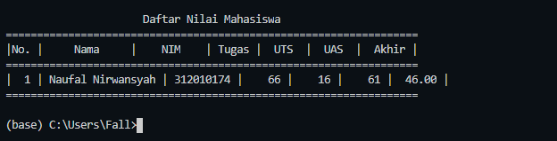

# Latihan-p9
<pre>
Nama    : Naufal Nirwansyah 
Kelas   : TI.20.A1
NIM     : 312010174
Dosen   : Agung Nugroho S.Kom, M.Kom
</pre>

***
 ## Praktikum 4

 Pada pertemuan ke-9 yang lalu, saya mendapat untuk mengerjakan task yang terdapat didalam materi pada pertemuan ke-9, berikut tugas yang diberikan oleh dosen saya : <br>
<div align="center">

</div>
<br>

Untuk membuat program yang diminta, saya menggunakan source code sebagai berikut: <br>
```
nilai = []
ulang = True

while ulang:
    nama = input("Masukkan Nama: ")
    nim = input("Masukkan NIM: ")
    tugas = int(input("Masukkan Nilai Tugas: "))
    uts = int(input("Masukkan Nilai UTS: "))
    uas = int(input("Masukkan Nilai UAS: "))
    akhir = (tugas * 30/100) + (uts * 35/100) + (uas * 35/100)

    nilai.append([nama, nim, tugas, uts, uas, int(akhir)])
    if (input("Tambah data (y/t)?") == 't'):
        ulang = False

print("\n                      Daftar Nilai Mahasiswa")
print("==================================================================")
print("|No. |     Nama     |    NIM    | Tugas |  UTS  |  UAS  |  Akhir |")
print("==================================================================")
i = 0
for item in nilai:
    i += 1
    print("| {no:2d} | {nama:12s} | {nim:9s} | {tugas:5d} | {uts:5d} | {uas:5d} | {akhir:6.2f} |"
          .format(no=i, nama=item[0], nim=item[1], tugas=item[2], uts=item[3], uas=item[4], akhir=item[5]))
print("==================================================================")
```
<br>

Source code diatas akan menghasilkan output program sebagai berikut: <br>
<div align="center">

</div>
<br>

***

**Penjelasan** <br>
1. Membuat variable list kosong <br>
```
nilai = []
ulang = true
```
Variable `ulang = True` digunakan untuk mengontrol pengulangan. 
<br>

2. Kemudian setelah itu kita membuat kondisi perulangan dan statement yang akan dijalakan kan ketika perulangan terjadi. <br>
```
while ulang:
    nama = input("Masukkan Nama: ")
    nim = input("Masukkan NIM: ")
    tugas = int(input("Masukkan Nilai Tugas: "))
    uts = int(input("Masukkan Nilai UTS: "))
    uas = int(input("Masukkan Nilai UAS: "))
    akhir = (tugas * 30/100) + (uts * 35/100) + (uas * 35/100)

    nilai.append([nama, nim, tugas, uts, uas, int(akhir)])
```
Dari statement diatas. Kita diminta untuk menginput: <br>
**Nama** <br>
**NIM** <br>
**Nilai Tugas** <br>
**Nilai UTS** <br>
**Nilai UAS** <br>

Lalu sistem akan mengjumlah nilai-nilai yang sudah diinput pada tiap-tiap nilai dan menghasilkan nilai akhir. Inputan itu kemudian masuk ke list **Akhir**.
<br>

3. Setelah membuat perulanagan, kita membuat statement untung stop atau keluar dari loop yang aktif. <br>
```
  if (input("Tambah data (y/t)?") == 't'):
        ulang = False
```
Untuk bisa keluar dari loop yang aktif kita harus pilih option **t** pada statement diatas `**y/t**`. <br>
`y = yes` <br>
`n = no` <br>
Ketika kita memilih option **t** proses itu akan membuat variable `ulang = True` menjadi `ulang = False` kemudian akan menghentikan loop yang aktif <br>

4. Mencetak Hasil Input <br>
```
print("\n                      Daftar Nilai Mahasiswa")
print("==================================================================")
print("|No. |     Nama     |    NIM    | Tugas |  UTS  |  UAS  |  Akhir |")
print("==================================================================")
i = 0
for item in nilai:
    i += 1
    print("| {no:2d} | {nama:12s} | {nim:9s} | {tugas:5d} | {uts:5d} | {uas:5d} | {akhir:6.2f} |"
          .format(no=i, nama=item[0], nim=item[1], tugas=item[2], uts=item[3], uas=item[4], akhir=item[5]))
print("==================================================================")
```
<br>
<div align="center">

</div>
<br>
***

# Terimakasih